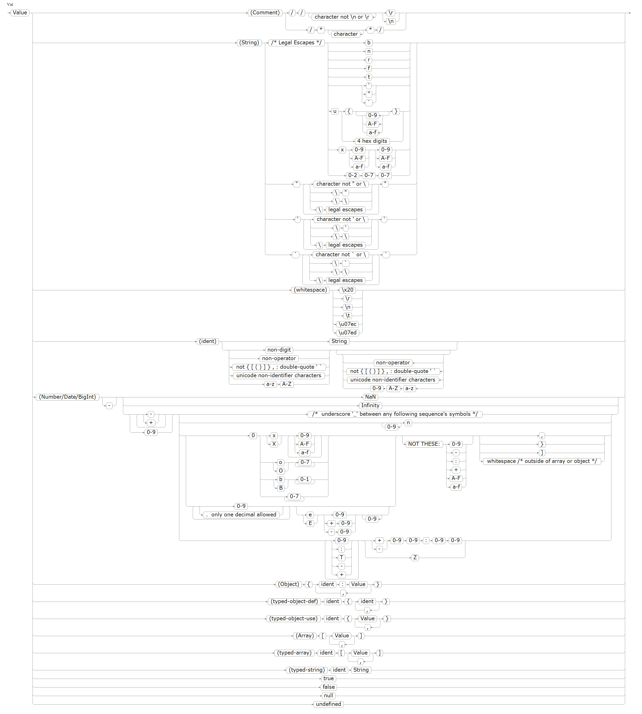
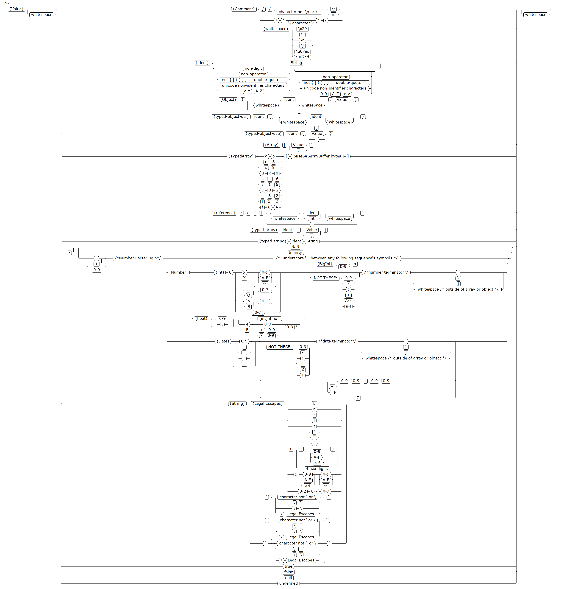
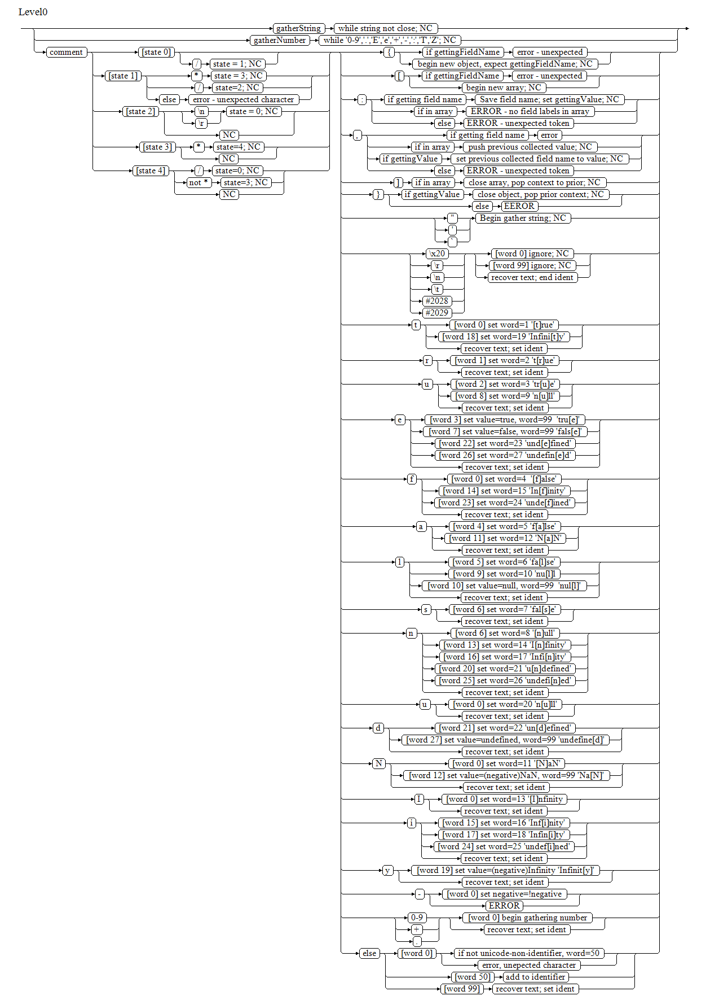

# JSOX – JavaScript Object eXchange format.


[](https://gitter.im/sack-vfs/jsox?utm_source=badge&utm_medium=badge&utm_campaign=pr-badge&utm_content=badge)

100% Compatible reader for JSON.  JSOX.stringify cannot generate JSON
compatible output; it would lose all the features anyway; use existing
`JSON.stringify()` if required, all JSON(JSON3/JSON5/JSON6) is valid JSOX.

JSOX adds Map, BigInt, Date, and TypeArray transport support, cyclic
objects, and includes keywords (5)'Infinity', (5)'NaN', (6)'undefined'.

JSOX adds optional processing of `typed` data.  Type names can be applied
to Objects, Arrays and Strings.  Type names are defined and provided with
to/from JSOX handlers by users of this library.   The data, decoded as
the object '{}', array '[]', or string '""' is passed to the fromJSOX 
handler, and the resulting value returned as the decoded object.
 
Typed-objects may also be emitted as a class-defintition and then class-references.
A class-defintition defines the fields in the object, and a class-reference would
provide the values for each field respectively.

A typed-object example: `v{ x, y } { a : v{1,2} }`, which decodes as `{ a : {x:1,y:2} }`.
It defines a template/class of object that has fields 'x', and 'y'.  Then
defines an object with a field A what is a object of type 'v', with values
(1), and (2).  This example does not gain any visible savings; savings 
comes when you have a lot of the same sort of record with the same field
names repeated often.


 * adds macro/class support for object field names.
 * adds support for bigint numbers; indicated with an 'n' suffix.
 * adds support for Date parsing and stringification; ISO dates as used are a sub-type of Number.
 * adds support for circular references.
 * typed-strings, typed-arrays, and typed-objects, for user defined types and to and from JSOX methods. [more](#jsox-typed-objects-typed-arrays-and-typed-strings)
 * C style commants; `//` and `/* */`.
 * string continuations using \ at the end of the line removes the newline; Otherwise strings continue until the next quote.
 * `"`, `'`, ` `` `, are all valid quote pairings, with no differnce in meaning, other than the quotes they contain.
 * adds optional underscores in numbers, allowing user formatting of log numbers.
 * fields are canonically ordered, so all objects that have the same field names will have their names in the same order.  Keys in Map()s are not ordered.
 * trailing commas are allowed, and silently ignored; however empty comma pairs in arrays will generate empty elements; and (throw an error in objects?).
 * and of course `o === JSOX.parse(JSON.stringify(o))` should always be exactly true.


### Example Encoding

```
r = JSOX.stringify( o = { 
	a: "simple object"
	, b:3
	, c:new Date()
	, d:123n
	, e:null
	, f:undefined
	, g:NaN
	, h:Infinity
	, i:-Infinity
	, j:-0.302 
	, k:new Uint8Array(9)}, null, 3 );
cnsole.log( "pretty:", o, "=\n", r );

// -- output --
pretty:
{
      a: "simple object",
      b: 3,
      c: 2018-09-14T02:55:27-07:00,
      d: 123n,
      e: null,
      g: NaN,
      h: Infinity,
      i: -Infinity,
      j: -0.302,
      k: u8[AAAAAAAAAAA=]
}
```

**JSOX is a proposed replacement to JSON** that aims to make it easier for
*humans to write and maintain* by hand, while also transporting the correct
type of the data.  Humans, for example, wouldn't hand-code a base64 encoding 
for a TypedArray; however sending a mesh from a server to a client already 
processed as a typed buffer ready for WebGL consumption may be of use. 

The class/tag support is entirely optional, and while it's goal is to reduce redundancy,
which for large datasets of similar records can benefit, it has been argued
that gzip could just be used to reduce the size; However, this also reduces
the size of the data to be parsed on input, which gzip does not do.

JSOX is a **(super-sub)set of JavaScript**, although adds **no new data types**,
and **works with all existing JSON content**. Some features allowed in JSOX
are not directly supported by Javascript; although all javascript parsable
features can be used in JSOX, except functions or any other code construct, 
transporting only data save as JSON.  Most ES6 structure can be parsed, 
with the extension of classes/tags the reverse is not true.  It was true for
JSON6.

JSOX is a proprosal for an official successor to JSON, and JSOX stringified 
content *will not* work with existing JSON parsers. For this reason, JSOX 
files use a new .jsox extension. *(TODO: new MIME type needed too.)*

The code is a **reference JavaScript implementation** for both Node.js
and all browsers. The code is derrived from JSON-6 sources.

## Why

Beyond the existing reasons for JSON5/JSON6 for their modifications; this
addresses the biggest shortcoming of JSON, which is the repetitive and redundant
specification of field names; especially when lots of the same sort of object
is represented.

This also aims to provide support for BigInt and Date format for less work
at the application layer.  **A method for handling typed array object members
should also be impelemented**

(Historic Why below)

JSON isn’t the friendliest to *write*. Keys need to be quoted, objects and
arrays can’t have trailing commas, and comments aren’t allowed — even though
none of these are the case with regular JavaScript today.

That was fine when JSON’s goal was to be a great data format, but JSON’s usage
has expanded beyond *machines*. JSON is now used for writing [configs][ex1],
[manifests][ex2], even [tests][ex3] — all by *humans*.

[ex1]: http://plovr.com/docs.html
[ex2]: https://www.npmjs.org/doc/files/package.json.html
[ex3]: http://code.google.com/p/fuzztester/wiki/JSONFileFormat

There are other formats that are human-friendlier, like YAML, but changing
from JSON to a completely different format is undesirable in many cases.
JSON6’s aim is to remain close to JSON and JavaScript.


## Features

The following is the exact list of additions to JSON’s syntax introduced by
JSOX. **All of these are optional**.

 - Concise representation of dates and times including as much information as is
available for the timestamp(timezone).  

 - Supports encode and decode of BigInt numbers with no application overhead. 
 - reduces overhead from none-requires quotes for identifiers.
 - can further reduce overall output size by using class tags ( Needs internal
implementation; although users can generate output simply ).

## Caveats

JSOX.stringify will produce output that JSON.parse cannot handle; JSOX.parse
can always handle JSON.stringify.

### Summary of Changes from JSON6

  - BigInt encoding
  - ISO date/time Encoding/decoding (as part of Number format)
  - Adds classes/tags to reduce redundant information.

### Summary of Changes from JSON5/JSON

  - Keyword undefined
  - Objects/Strings back-tick quoted strings (no template support, just quotes); Object key names can be unquoted.
  - Strings - generous multiline string definition; all javascript character escapes work. \(\x##, \0###, \u####, \u\{\} \)
  - Numbers - underscore digit separation in numbers, octal and binary formats; all javascript number notations.
Addtionally support leading 0 to interpret as octal as C, C++ and other languages support.
  - Arrays - empty members
  - Streaming reader interface
  - (Twice the speed of JSON5; subjective)


## Additional support above JSON base

All items listed below are JSON5 additions if not specifed as JSON6.

### 

### ArrayBuffer/TypedArray

- (**JSOX**) Support transporting ArrayBuffer and TypedArray fields. This is implemented with constants as tags applied prefixing and opening brace '\[' and encoding the binary data as a base64 string(without quotes) before the closing ']'.
  - these are prefix tags that can be applied.  u8, u16, cu8, u32, s8,s16, s32, f32, f64, ab; the array is a base64 string without quotes.
  - Base64 is as dense as is feasible; it's a 33% loss; where utf8 encoding of random bytes is 50% loss.  Something like base127 would be 7 bytes to 8 encoded bytes; and potential length penalty of 5 bytes.

### Objects

- Object keys can be unquoted if they do not have ':', ']', '[', '{', '}', ',', any quote or whitespace, and do not begin like a number.

- Object keys can be single-quoted, (**JSON6**) or back-tick quoted; any valid string 

- Object keys can be double-quoted (original JSON).

- Objects can have a single trailing comma. Excessive commas in objects will cause an exception. '{ a:123,,b:456 }' is invalid.

[mdn_variables]: https://developer.mozilla.org/en/Core_JavaScript_1.5_Guide/Core_Language_Features#Variables

### Arrays

- Arrays can have trailing commas. If more than 1 is found, additional empty elements will be added.

- (**JSON6**) Arrays can have comma ( ['test',,,'one'] ), which will result with empty values in the empty places.

### Strings

- Strings can be double-quoted (as per original JSON).

- Strings can be single-quoted.

- Strings can be back-tick (\`) ([grave accent](https://en.wikipedia.org/wiki/Grave_accent)) -quoted.

- Strings can be split across multiple lines; just prefix each newline with a
  backslash. [ES5 [§7.8.4](http://es5.github.com/#x7.8.4)]

- (**JSON6**) all strings will continue keeping every character between the start and end, this allows multi-line strings 
  and keep the newlines in the string; if you do not want the newlines they can be escaped as previously mentioned.

### Numbers

- (**JSOX**) BitInt numbers are stringified with suffix of 'n' as in ES(?), and implemented in V8(google/chrome/node) 2018/09/12.  BigInt number parsed with 'n' suffix.

- (**JSON6**) Numbers can have underscores separating digits '_' these are treated as zero-width-non-breaking-space. ([Proposal](https://github.com/tc39/proposal-numeric-separator) with the exception that _ can preceed or follow . and may be trailing.)

- Numbers can be hexadecimal (base 16).  ( 0x prefix )

- (**JSON6**) Numbers can be binary (base 2).  (0b prefix)

- (**JSON6**) Numbers can be octal (base 8).  (0o prefix)

- (**JSON6**) Numbers can be octal (base 8).  (0 prefix followed by more numbers, without a decimal)

- Numbers can begin or end with a (leading or trailing) decimal point.

- Numbers can include `Infinity`, `-Infinity`, `NaN`. 

- Numbers can begin with an explicit plus sign.

- Numbers can begin with multiple minus signs. For example '----123' === 123.

### Dates

- (**JSOX**) Encodes date time with local timestamp information to recover as much information as the original date contained.  Is treated as a subtype of Number parsing; and are stored without quotes.

### Keyword Values

- (**JSON6**) supports 'undefined' in addition to 'true', 'false', 'null'.

### Comments

- Both inline (single-line using '//' (todo:or '#'?) ) and block (multi-line using \/\* \*\/ ) comments are allowed.


```
// simple example, array buffer with 8 bytes
var ab = new ArrayBuffer([0,1,2,3,4,5,6,7]);
console.log( JSOX.stringify( {ab:new Float32Array(ab)} ) );

// example output
{ab:f32[AAECAwQFBgc=]}
```


#### Base64 vs UTF-8 Encoding

UTF-8, for character 0-127 requires 1 byte; 128-255 requires 2 bytes.  For random data 0-255, 1.5 bytes will, on average, bt used
to represent the string.  So this is 150% larger than the original string.  Even if like a base 2^40 bits, which would encode 5 bytes 
into a single (very extended) utf8 encoding, each byte has the prefix of 2 bits `10xx xxxx`, which gives 6 bits per byte used.

Base64 is 6 bits per byte used, so instead of having a complex encoder, base64 is the optimal of 3:4 byte expasion (133%) which is 
the ideal that extra-long UTF8 encoding coule reach.

An alternative might be a base128 encoding, which would be close to utf-8, but would actually require 129 characters, one to indicate
the bytes that are unused.  7 bytes expand to 8, gathering the top bit of each of the 7 bytes of each one into one more byte; it could
be an optimal encoding using code points 0-128 (128 being the end terminator like '=' in base64).  But, this also mean that up to 5
bytes of waste may be included.  That is incomplete values at the end of the string have to be marked as unused.

## Pretty Images

Image produced by [EBNF Visualizer (Windows)](http://dotnet.jku.at/applications/Visualizer/#Down)
from [jsox.ebnf](jsox.ebnf)



  

## Example conversion

The following is a contrived example, but it illustrates most of the features:

```js
{
    foo: 'bar',
    while: true,
    nothing : undefined, // why not?

    this: 'is a \
multi-line string',

    thisAlso: 'is a
multi-line string; but keeps newline',

    // this is an inline comment
    here: 'is another', // inline comment

    /* this is a block comment
       that continues on another line */

    hex: 0xDEAD_beef,
    binary: 0b0110_1001,
    decimal: 123_456_789,
    octal: 0123,
    half: .5,
    delta: +10,
    negative : ---123,
    to: Infinity,   // and beyond!

    ,,,,,,  // some empty fields...

    finally: 'a trailing comma',
    oh: [
        "we shouldn't forget",
        'arrays can have',
        'trailing commas too',
    ],
}
```

This implementation’s own [package.jsox](package.jsox) is more realistic:

```js
// This file is written in JSOX syntax, naturally, but npm needs a regular
// JSON file, so compile via `npm run build`. Be sure to keep both in sync!

{
    name: 'JSOX',
    version: '0.1.105',
    description: 'JSON for the ES6 era.',
    keywords: ['json', 'es6'],
    author: 'd3x0r <d3x0r@github.com>',
    contributors: [
        // TODO: Should we remove this section in favor of GitHub's list?
        // https://github.com/d3x0r/JSOX/contributors
    ],
    main: 'lib/JSOX.js',
    bin: 'lib/cli.js',
    files: ["lib/"],
    dependencies: {},
    devDependencies: {
        gulp: "^3.9.1",
        'gulp-jshint': "^2.0.0",
        jshint: "^2.9.1",
        'jshint-stylish': "^2.1.0",
        mocha: "^2.4.5"
    },
    scripts: {
        build: 'node ./lib/cli.js -c package.JSOX',
        test: 'mocha --ui exports --reporter spec',
            // TODO: Would it be better to define these in a mocha.opts file?
    },
    homepage: 'http://github.com/d3x0r/JSOX/',
    license: 'MIT',
    repository: {
        type: 'git',
        url: 'https://github.com/d3x0r/JSOX',
    },
}
```


## Community

Join the [Google Group](http://groups.google.com/group/JSOX) if you’re
interested in JSOX news, updates, and general discussion.
Don’t worry, it’s very low-traffic.

The [GitHub wiki](https://github.com/d3x0r/JSOX/wiki) (will be) a good place to track
JSOX support and usage. Contribute freely there!

[GitHub Issues](https://github.com/d3x0r/JSOX/issues) is the place to
formally propose feature requests and report bugs. Questions and general
feedback are better directed at the Google Group.


## Usage

This JavaScript implementation of JSOX simply provides a `JSOX` object just
like the native ES5 `JSON` object.

To use from Node:

```sh
npm install jsox
```

```js
var JSOX = require('jsox');
```

To use in the browser (adds the `JSOX` object to the global namespace):

```html
<script src="node_modules/jsonx/lib/jsox.js"></script>
```

Then in both cases, you can simply replace native `JSON` calls with `JSOX`:

```js
var obj = JSOX.parse('{unquoted:"key",trailing:"comma",}');
var str = JSOX.stringify(obj); /* uses JSON stringify, so don't have to replace */
```

|JSOX Methods | return | parameters | Description |
|-----|-----|-----|----|
|parse| the first value| (string [,reviver]) | supports all of the JSOX features listed above, as well as the native [`reviver` argument][json-parse]. |
|stringify| string | ( value[,replacer[,space]] ) | converts object to JSOX.  [stringify][json-stringify] |
|stringifier |  Stringifier(methods below)| () | Gets a utility object that can stringify.  The object can have classes defined on it for stringification |
|escape | string | ( string ) | substitutes ", \, ', and \` with backslashed sequences. (prevent 'JSON injection') |
|begin| Parser(methods below) |(cb [,reviver] ) | create a JSOX stream processor.  cb is called with (value) for each value decoded from input given with write().  Optional reviver is called with each object before being passed to callback. |
|registerToJSOX  | none | (name,prototype,toCb) | For each object that matches the prototype, the name is used to prefix the type; and the cb is called to get toJSOX.  | Instead of setting prototype extensions, provides a way to register formatters for prototypes.  These are shared for all stringifier instances, and need only be set once. |
|registerFromJSOX| none | (name,fromCb) | fromCb is called whenever the type 'name' is revived.  The type of object following the name is passd as 'this'. |
|registerToFrom  | none | (name,prototype,toCb, fromCb) | register both to and from for the same name |


|Stringifier method | return | parameters | Description |
|-------|------|-----|----|
|stringify | string | (value[,replacer[,space]] ) | converts object to JSOX attempting to match objects to classes defined in stringifier.  [stringify][json-stringify] |
|registerToJSOX | none  | (name,prototype,toCb) | For each object that matches the prototype, the name is used to prefix the type; and the cb is called to get toJSOX.  | Instead of setting prototype extensions, provides a way to register formatters for prototypes.  These are shared for all stringifier instances, and need only be set once. |
|setQuote | none | ( quote ) | the argument passed is used as the default quote for strings and identifiers as required. |
|defineClass | none | ( name, object ) | Defines a class using name 'name' and the fields in 'object'.  This allows defining for some pre-existing object; it also uses the prototype to test (if not Object), otherwise it matches based on they Object.keys() array. |

|Parser Methods | parameters | Description |
|-----|-----|-----|
|write | (buffer) | add data to the parser stream |
|registerFromJSOX| (name,fromCb) | fromCb is called whenever the type 'name' is revived.  The type of object following the name is passd as 'this'. |


[json-parse]: https://developer.mozilla.org/en-US/docs/Web/JavaScript/Reference/Global_Objects/JSON/parse
[json-stringify]: https://developer.mozilla.org/en-US/docs/Web/JavaScript/Reference/Global_Objects/JSON/stringify


#### registerToJSOX

Registers a handler to convert a type to JSOX.  This method is used to avoid modification of prototypes; would require instead 
that ojects that have a toJSOX know of the JSOX module instead.  The result of the callback should be a string, and is up to the
toJSOX method to include quotes if it is a string value.  Any string may result that is valid JSOX.

Regsitering the same name more than once throws an error.

```
JSOX.registerToJSOX( "stringTest", stringTest.prototype, function() { return '"' + this.toString() + '"' } );
```

#### registerFromJSOX

Registers a handler to convert recovered string, array or object from JSOX.  The converted data from the JSOX stream is passed as
'this'.  The result of the callback may be any type of value; the resulting value is used instead of the data converted from JSOX.

Regsitering the same name more than once throws an error.

```
// this epects a string, as indicated by the above toJSOX output.
JSOX.registerFromJSOX( "stringTest", function() {
	console.log( "Resuurect from String:[%s]", this /*string*/ );
	return new stringTest( this );
} );
```

#### registerToFrom

Registers both to and from methods or a spsecified name, using the specified prototype to match during stringify.
Internally, calls the above functions with the parameters split as appropriate.

Regsitering the same name more than once for From or To throws an error.

```
JSOX.registerToFrom( "stringTest", stringTest.prototype
	, function() { return '"' + this.toString() + '"' }
	, function() {
		console.log( "Resuurect from String:[%s]", this /*string*/ );
		return new stringTest( this );  // some stringTest class with string initializer
	}
);
```

### JSOX typed-objects, typed-arrays, and typed-strings

typed-data is represented in the JSOX stream as \<identifier\>\[data\].  For objects, this is a document compression technique,
which reduces the size of data to process.  For arrays, internally, fixed types represent ES6 TypedArray types (u8,s8, u16,f32,etc);
Another internal type is 'ref' which uses the array to have a list of element identifiers that define the path to the original object
reference.  Another, simple variation is to implement typed-strings, which allows `color"0x1234568"` to have a `fromJSOX` method that
is passed the string, and can result with a color object.

In each case, in the following example JSOX, the same 'color' fromJSOX 
method will be called.  It will be invoked with a string, with an array, 
with an object, with an object, and with an object respectively.

```
var JSOX= require( "JSOX" );

function Color() {
	this.r = 100;
        this.g = 150;
        this.b = 20;
}

// notice that the literal quotes to result as output are returned here.
// this allows the encoder to use an object {}, an array [] or a string ""
// to pass to the reviver function. 
sack.JSOX.registerToFrom( "color", Color.prototype, function() { return '"#'+this.r.toString(16)+this.g.toString(16)+this.b.toString(16)+ '"'; }
           , function() { return '"#'+this.r.toString(16)+this.g.toString(16)+this.b.toString(16)+ '"'; }
           );

var c = new Color();

JSOX.stringify( c ) ); // result is 'color"#649614"'
JSOX.parse( JSOX.stringify( c ) ); // result is   'Color { r: 100, g: 150, b: 20 }'  (console.log)

```
// this are all variations which may be used to revive a color object
color"0x12345678"                   // typed-string
color[0x12,0x34,0x56,0x78]          // typed-array

// at a root level, the first 'color' definition encountered
// is used to create a field-name map.  Then later usages
// sould only specify the values.
color{r,g,b,a}            // typed-object definition
color{0x12,34,0x56,0x78}  // typed-object subsequent usage

// if no typed-object definition is rquired, then 
// the typed-object must never be used at a root level.

{ a : color{r:0x12,g:0x34,b:0x56,a:0x78} } // object containing typed-object fromJSOX only, no pre-field-definition
[ color{r:0x12,g:0x34,b:0x56,a:0x78} ]     // array containing typed-object fromJSOX only, no pre-field-definition
```

Typed strings have a caveat; at a root level, strings which are typed, MUST have 
unquoted-identifier strings indicating their type.  Because the closing quote is 
a definitive end-of-data marker, quoted strings at a root level always emit as a 
completed string; This also requires no space between the unquoted-identifier string
and the quoted data string.  

Typed-object and typed-arrays also require the identifer or string used for their
type information not be followed by a space before the opening '{', '\[' or quoted 
string. 

### More on Classes/Tags - typed-object and typed-array

(constant initializers on typed-objects are not yet supported?)

The definition of a class is an identifer at the top level (before the JSON data) followed immediately by an open brace ('{'),
whitespace is not allowed.  Within the open brace '{' until the close '}' is a list of names seprated by commas, and of
constants indicated by an identifier followed by a colon and a value.

All objects created with a class/tag definition shares the same prototype.

```

tagdef : identifier '{' identifier [ ',' identifier ] ... '}'
tagdef : identifier '{' constant_initializer [ ',' identifier ] ... '}' (TBI)

constant_initializer : identifier ':' value 

```

Usage of tags is done by specifing their identifer followed by an open brace '{' in the value 
field of an object definition; or at a top level referencing the same tag name already defined.
For each field defined in the class, a value is expected.  If a value is not found, the field
will not be added, as if receiving `field:undefined`.

```

tag usage : ':' identifier '{' value [ ',' value ]... '}' 

//-- the following...
a { firstField, secondField }
a { 1, 2 }
//-- results as
{ firstField : 1, secondField : 2 }


//-- the following...
a { firstField, secondField }
[ a { 1, 2 }, a(5,6), a("val1","val2") ]
//-- results as
[ { firstField : 1, secondField : 2 }, { firstField : 5, secondField : 6 }, { firstField : "val1", secondField : "val2" } ]

```

Implementation of tags allows apply a class to arrays.  Arrays have a class of ArrayBuffer, or other TypedArray type.  The
representation path in an array and a reference type for the array. This allows circular encoding.

```
// this is a string with a reference.
{company:{name:"Example.com",employees:[{name:"bob"},{name:"tom"}],manager:ref["company","employees",0]}}

// The above 'ref[]' gets resolved into the same employee object...
OUT: ./file6.jsox { company:
   { name: 'Example.com',
     employees: [ /*a*/{ name: 'bob' }, { name: 'tom' } ],
     manager: /*a*/{ name: 'bob' } } }
```


### JSOX Streaming

A Parser that returns objects as they are encountered in a stream can be created.  `JSON.begin( dataCallback, reviver );`  The callback is called for each complete object in a stream of data that is passed.  

`JSOX.begin( cb, reviver )` returns an object with a few methods.

| Method | Arguments | Description | 
|:---|:---|:---|
| write | (string) | Parse string passed and as objects are found, invoke the callback passed to `begin()` Objects are passed through optional reviver function passed to `begin()`. |
| \_write | (string,completeAtEnd) | Low level routine used internally.  This does the work of parsing the passed string. Returns 0 if no object completed, 1 if there is no more data, and an object was completd, returns 2 if there is more data and a parsed object is found.  if completedAtEnd is true, dangling values are returned, for example "1234" isn't known to be completed, more of the number might follow in another buffer; if completeAtEnd is passed, this iwll return as number 1234.  Passing empty arguments steps to the next buffered input value. |
| value | () | Returns the currently completed object.  Used to get the completed object after calling \_write. |
| reset | () | If `write()` or `_write()` throws an exception, no further objects will be parsed becuase internal status is false, this resets the internal status to allow continuing using the existing parser.  ( May require some work to actually work for complex cases) |
| usePrototype | (className,protoType) | configure what prototypes to use for class recovery |


```js
   // This is (basically) the internal loop that write() uses.
   var result
   for( result = this._write(msg,false); result > 0; result = this._write() ) {
      var obj = this.value();
      // call reviver with (obj)
      // call callback with (obj)
   }
```

```js
// Example code using write
function dataCallback( value ) {
	console.log( "Value from stream:", value );
}
var parser = JSON.begin( dataCallback );

parser.write( '"Hello ' );   // a broken simple value string, results as 'Hello World!' 
parser.write( 'World!"' );
parser.write( '{ first: 1,' );   // a broken structure
parser.write( ' second : 2 }' );
parser.write( '[1234,12');  // a broken array across a value
parser.write( '34,1234]'); 
parser.write( '1234 456 789 123 523');  // multiple single simple values that are numbers
parser.write( '{a:1} {b:2} {c:3}');  // multiple objects

parser.write( '1234' );  // this won't return immediately, there might be more numeric data.
parser.write( '' ); // flush any pending numbers; if an object or array or string was split, throws an error; missing close.

parser.write( '1234' ); 
parser.write( '5678 ' );  // at this point, the space will flush the number value '12345678' 

```


### Extras

If you’re running this on Node, you can also register a JSOX `require()` hook
to let you `require()` `.jsox` files just like you can `.json` files:

```js
require('jsox/lib/require');
require('./path/to/foo');   // tries foo.jsox after foo.js, foo.json, etc.
require('./path/to/bar.jsox');
```

This module also provides a `jsox` executable (requires Node) for converting
JSOX files to JSON:

```sh
jsox -c path/to/foo.jsox    # generates path/to/foo.json
```

## Other Implementations

This is also implemented as part of npm [sack.vfs](https://www.npmjs.com/package/sack.vfs)
as a native code node.js addon.  This native javascript version allows usage in browsers.

C/C++ Amalgam version [jsox-wasm](https://www.github.com/d3x0r/jsox-wasm)

Possible release of amagamated source, native Node Addon (standalone).  (Amalagmanted source is for now in jsox-wasm repository)

Working on a WebAssembly version. [jsox-wasm](https://www.github.com/d3x0r/jsox-wasm)

## Benchmarks

~~This is as fast as the javascript version of Douglas Crockford's reference implementation [JSON implementation][json_parse.js] for JSON parsing.~~

~~This is nearly double the speed of [JSON5](http://json5.org) implementation that inspired this (which is half the speed of Crockford's reference implementation).~~

~~This is half the speed of the sack.vfs native C++ node addon implementation (which itself is half the speed of V8's native code implementation, but they can cheat and build strings directly).~~


## Development

```sh
git clone https://github.com/d3x0r/jsox
cd jsox
npm install
npm test
```

As the `package.jsox` file states, be sure to run `npm run build` on changes
to `package.jsox`, since npm requires `package.json`.

Feel free to [file issues](https://github.com/d3x0r/jsox/issues) and submit
[pull requests](https://github.com/d3x0r/JSOX/pulls) — contributions are
welcome. If you do submit a pull request, please be sure to add or update the
tests, and ensure that `npm test` continues to pass.


## Changelog
- 1.1.114
    - Cricial Fix - clear arrayType when opening a new object or array (circular object decode)
    - Reference fix when referencing the root node.
- 1.1.113
    - fix leftover test code in require.js.
- 1.1.111
    - fix packaging.
- 1.1.101
    - Minor patch to get a long miner version
    - fixed base64 decoding to handle terminations better.
- 1.1.1
    - added Map() builtin type for JS which is type 'map'.
    - Fixed expression which quoted words with 'S' or 's' in them.
    - Fixed Known array types.
- 1.1.0 
    - Added stringifier/parser instance specific registrations for ToJSOX and FromJSOX handlers.
    - removed unicode non-identifier check, prefering instead just the set of structure characters (basically anything which is not caught before the end begins an identifier).  This simplifies testing field names for encoding/stringification.
- 1.0.8 - Sort object fields case insensitively; standardize field ordering.
- 1.0.7 - Fixed some stream parsing issues with identifiers.
- 1.0.6 - just updated build products
- 1.0.5 
    - Fix streaming ability
    - consequtive strings only have whitespace to separate them, so identifiers for defining typed-objects cannot have whitespace between them and '{'.
    - (reverted)implement test for non-identifier characters to quote field strings (or not).  Implement reading non-identifier characters, and fault if identifier is unquoted and has such a character.
    - implement typed-strings, which can be used to trigger constructors which accept single strings.
    - update readme with typed-strings, typed-arrays, and typed-objects.
    - performance fix; was keeping parser objects forever.
- 1.0.4 - Be more forgiving about platforms not having BigInt native support.
- 1.0.3 - Add ability to register prototypes to use for decoding.
- 1.0.2 - Issue with mutiple leading and trailing spaces. Fix collecting streams of numbers.  Fix an issue with nested classes.  Add circular reference support.
- 1.0.1 - Removed modification of object prototypes; instead track object prototype to formatting function in a WeakMap().  Fixed class expansion.  Make objects of a class share the same prototype.
- 1.0.0 - Intial Release.

## Benchmarks

tests/bench/bench1.js 
Testing vs both minified and original source versions.
number is N;1 for how much slow this is than the native Node JSON implementation (which is really V8 native code).

Test runs a number of iterations for 2 seconds, and compares the number of stringifications/parsings are done in that time.

Numbers shown are multipliers of time for JSOX.  (yes it's 50%-25% the speed depending on operation, but much faster than other JSON external scripts)

|minified/source|version|stringify|parse|
|-----|-------|-----|----|
|(min)|node-7.9.0  | 3.6506  | 11.62666  |
|(raw)|Node 9.6.1(x32) |  1.9586|  4.2622  |
|(min)|Node 9.6.1(x32) |  2.4322 | 4.5402  |
|(raw)|Node 10.5(x64)  |  2.3943 | 3.9279  |
|(min)|Node 10.5(x64) |   1.9431|  3.7633  |
|(raw)|node 11.0(x32) |  1.9930|  4.3351  |
|(min)|node 11.0(x32) |  2.3688 | 4.5517  |
|(raw)|node 11.0(x64) |  2.1390 | 4.0648  |
|(min)|node 11.0(x64)  | 1.9226 | 3.9686  |
| JSON5 vs Node JSON|  |  | |
|(raw)|node 11.0(x64) |  1.8150 | 13.6190  | 
| JSON5 vs JSOX|  |  | |
|(min)|node 11.0(x64)  |  1.1456 |  0.3 |

The difference from 1.9x to 2.4x is 20% difference.

Example benchmark output Shows resulting stringify result

```
JSOX String Did 441000 in 2011 {a:123,b:467,c:"1234",d:35.1,e:2018-11-06T06:38:29-08:00}
JSOX Parse  Did 606000 in 2000
JSON String Did 954000 in 2000 {"a":123,"b":467,"c":"1234","d":35.1,"e":"2018-11-06T14:38:33.984Z"}
JSON Parse  Did 2601000 in 2001
JSON5 String Did 519000 in 2001 {a:123,b:467,c:'1234',d:35.1,e:'2018-11-06T14:38:37.990Z'}
JSON5 Parse  Did 189000 in 2017
JSON5 String Did 975000 in 2004 {"a":123,"b":467,"c":"1234","d":35.1,"e":"2018-11-06T14:38:42.012Z"}
JSON5 Parse  Did 873000 in 2001
Node JSON v JSOX
stringify 2.163265306122449
parse     4.292079207920792
Node JSON v JSON5
stringify 1.8381502890173411
parse     13.761904761904763
Node JSON v JSON6
stringify 0.9784615384615385  (JSON6 Same)  (uses same function)
parse     2.979381443298969
JSON5 v JSOX
stringify 1.1768707482993197
parse     0.3118811881188119  (JSOX Win 3.33x faster)
JSON5 v JSON6
stringify 0.5323076923076923  (JSON6 WIN)  (uses same as Node function)
parse     0.21649484536082475 (JSON6 Win, almost 5x faster)
JSON6 v JSONX
stringify 2.2108843537414966
parse     1.4405940594059405
```

## License

MIT. See [LICENSE.md](./LICENSE.md) for details.


## Credits

(http://github.com/json5/json5)  Inspring this project.

[json_parse.js]: https://github.com/douglascrockford/JSON-js/blob/master/json_parse.js
